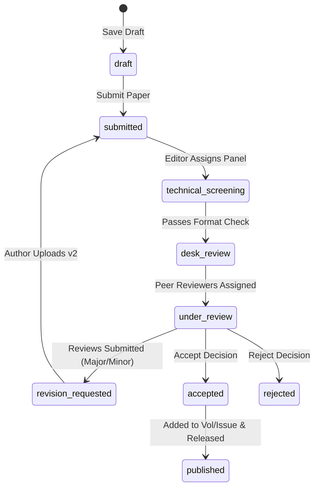

# The Journal of Advanced Scientific Frontiers (TJASF)
## Product Requirements Document (PRD)

---

### 1. Product Overview
The Journal of Advanced Scientific Frontiers (TJASF) is a multidisciplinary, open-access, peer-reviewed journal. The goal of this platform is to support the submission, review, editorial management, and public distribution of scientific papers.

#### Vision & Core Objectives
* **Multidisciplinary Research**: Bridges physical sciences, life sciences, computational science, environmental systems, engineering, and social sciences.
* **Open Access (No APCs)**: All publications are free to download under Creative Commons license (CC BY 4.0).
* **Double-Blind Peer Review**: Reviewers do not know authors' identities, and authors do not know reviewers' identities.
* **Integrity**: Standardized screening for plagiarism, AI-assistance disclosures, funding source declarations, and conflict of interest statements.

---

### 2. Brand Identity & Styling

#### Typography
* **Primary Font**: `DM Sans`, sans-serif (used for UI elements, statistics, and main paragraphs).
* **Serif Font**: `Playfair Display`, serif (used for brand titles, volume numbers, and article headings).

#### Color Palette
| Color Variable | Value | Description |
| :--- | :--- | :--- |
| `--navy` | `#102342` | Primary branding navy, header navigation, buttons |
| `--navy-deep` | `#08172f` | Footer background, top bar highlight |
| `--orange` | `#eb5526` | Accent, warnings, highlight links, step indices |
| `--paper` | `#fbfaf8` | Main canvas color, subtle warm tone |
| `--line` | `#d8d8d1` | Borders, thin dividing lines |
| `--muted` | `#667082` | Secondary copy, descriptors |

---

### 3. Website Information Architecture

#### Public Site Routes
* `/` — **Homepage**: Shows featured issues, latest published papers, announcements, and call to action pathways.
* `/about` — **About Journal**: Aims, scope, editorial board philosophy, and indexing targets.
* `/editorial-board` — **Editorial Board**: Profiles of active international editors.
* `/current-issue` — **Current Issue**: Shows the table of contents of the most recently published volume/issue.
* `/archives` — **Archives**: Chronicles past volumes and published issues.
* `/issue/:id` — **Issue Detail**: Table of contents for a chosen historical issue.
* `/search` — **Search Page**: Search database for papers by title, abstract, authors, or domain.
* `/contact` — **Contact Page**: Query form, address, and support emails.
* `/article/:id` — **Article Detail**: View abstract, keywords, references, page counts, views, and download the PDF.

#### Auth Routes
* `/login` — **Login**: Sign-in portal using email and password.
* `/register` — **Registration**: User profile signup (default role: Author).

#### Workspace Routes (Protected)
* `/submit` — **Submit Manuscript**: Wizard to enter title, domain, author list, abstract, references, files, and agreements.
* `/dashboard` — **Dashboard Home**: Summary of manuscripts, review tasks, or editorial queue based on role.
* `/dashboard/manuscripts` — **My Manuscripts**: Author submission manager.
* `/dashboard/reviews` — **My Reviews**: Reviewer assignment list.
* `/dashboard/reviews/:id` — **Review Detail**: Accept/decline panel, abstract reviewer worksheet, comments to editor/author.
* `/dashboard/editor` — **Editor Workspace**: Full manuscript pipeline index.
* `/dashboard/editor/:id` — **Manuscript Editor**: Change pipeline states, assign peer reviewers, check comments.

#### Admin-Only Dashboard Routes (Protected)
* `/dashboard/admin/users` — **User Manager**: Edit profiles and user roles.
* `/dashboard/admin/domains` — **Research Domains**: Categories editor.
* `/dashboard/admin/editorial-board` — **Editorial Board manager**: Add, edit, or reorder profile cards.
* `/dashboard/admin/issues` — **Volumes & Issues**: Create volumes, define issues, and toggle publication states.
* `/dashboard/admin/policies` — **Policies Manager**: Manage editorial policy articles.
* `/dashboard/admin/announcements` — **Announcements**: Publish pinned news updates.
* `/dashboard/admin/homepage` — **Homepage editor**: Edit homepage copy blocks.

---

### 4. User Roles & Permissions

#### System Roles
1. **Author**: Default signed-up user. Can submit manuscripts, check status, and submit revisions.
2. **Reviewer**: Assigned to peer-review manuscripts. Can accept/decline review requests, read abstracts, download papers, and post scores.
3. **Section Editor**: Assigns peer reviewers and updates submission status for papers in their domain.
4. **Managing Editor**: Oversees review pipelines across all sections and assists in issue grouping.
5. **Editor-in-Chief**: Decides on final acceptance/rejection and manages publishing releases.
6. **Admin**: Manages site configurations, user roles, policy documents, announcements, and homepage content.

---

### 5. Manuscript Pipeline Workflow

---

### 6. Submission Form Specifications & Fields

#### Wizard Steps
1. **Manuscript Info**:
   * Title (Text, Required)
   * Research Domain (Dropdown select, Required)
2. **Authors**:
   * Multiple author blocks (Add/Remove dynamic lists)
   * Name (Text, Required)
   * Email (Text, Optional)
   * Affiliation (Text, Optional)
   * Department (Text, Optional)
   * Corresponding flag (Radio select, exactly one corresponding author required)
3. **Abstract & Keywords**:
   * Abstract text (Textarea, Required, max 300 words recommended)
   * Keywords (Comma-separated text, Required, 3-5 keys)
4. **Upload & References**:
   * File Upload (PDF, DOC, DOCX, Max 20MB, Required)
   * References text (Textarea, Required)
5. **Declarations & Confirmations**:
   * Original work statement (Checkbox, Required)
   * Copyright agreement (Checkbox, Required)
   * Policies compliance (Checkbox, Required)
   * Conflict of interest (Checkbox)
   * Funding disclosure (Checkbox)
   * AI assistance statement (Checkbox)
   * Previously submitted statement (Checkbox)

---

### 7. Database Structure & Schemas
The database runs on Supabase (PostgreSQL) with Row Level Security (RLS) enabled on all tables.

#### Table Details
* **profiles**: User metadata referencing `auth.users(id)`.
* **domains**: Active scientific domains (e.g. Life Sciences).
* **editorial_board**: Board member profiles for public display.
* **manuscripts**: Author submissions, statuses, and assigned editors.
* **manuscript_authors**: Linked author lists for each manuscript.
* **reviews**: Peer review tracking sheet.
* **volumes**: Volume index.
* **issues**: Issue index linked to volumes.
* **articles**: Published manuscripts containing DOIs and view counts.
* **policies**: Core legal documentation and ethical rules.
* **announcements**: Pinned homepage announcements.
* **homepage_content**: Dynamic copy blocks for the website landing copy.
* **email_templates**: Configurable notifications.
* **audit_log**: Changes tracked by editor/admin users.

---

### 8. Future Roadmap Targets
1. **Automated Plagiarism Screening**: Integration of plagiarism APIs during technical screening.
2. **DOAJ and Scopus Indexing**: Metadata compliance formatting.
3. **Interactive PDF Viewer**: Embedded annotation tools for peer reviewers.
